# 🚀 Kubernetes GKE DevOps Observability Platform

<p align="center">


</p>

---

# 📌 Project Overview

This project demonstrates a complete **Cloud-Native Kubernetes DevOps Platform** deployed on **Google Kubernetes Engine (GKE)** with:

✅ NGINX Application Deployment  
✅ Kubernetes Horizontal Pod Autoscaler (HPA)  
✅ Metrics Server Integration  
✅ Prometheus Monitoring Stack  
✅ Grafana Dashboards & Observability  
✅ Helm-based Monitoring Deployment  
✅ LoadBalancer Exposure  
✅ Real-time Autoscaling & Monitoring  
✅ CI/CD Workflow Architecture using Jenkins  

---

# 🏗️ Enterprise DevOps Architecture


---

# 📊 Detailed Workflow Implementation

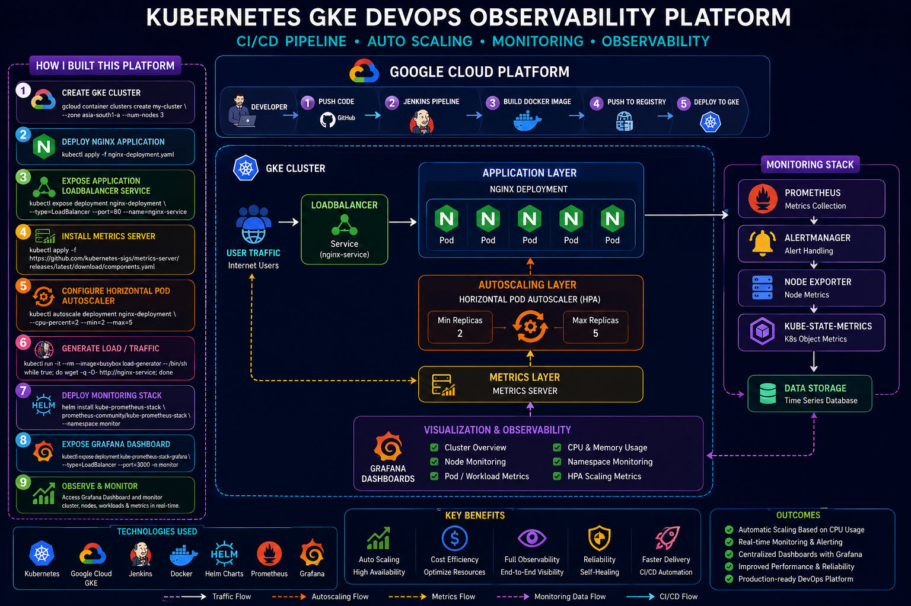

---

# 🔄 Complete Workflow

```text
Developer
   │
   ▼
GitHub Repository
   │
   ▼
Jenkins CI/CD Pipeline
   │
   ▼
Docker Image Build & Push
   │
   ▼
Google Kubernetes Engine (GKE)
   │
   ├── NGINX Deployment
   ├── LoadBalancer Service
   ├── Metrics Server
   ├── Horizontal Pod Autoscaler (HPA)
   ├── Prometheus Monitoring
   └── Grafana Dashboards
```

---

# ⚙️ Tech Stack

| Category | Technologies |
|---|---|
| Cloud Platform | Google Cloud Platform (GCP) |
| Container Orchestration | Kubernetes (GKE) |
| Web Server | NGINX |
| Autoscaling | Kubernetes HPA |
| Monitoring | Prometheus |
| Visualization | Grafana |
| Package Manager | Helm |
| CI/CD | Jenkins |
| Metrics Collection | Metrics Server |
| Networking | LoadBalancer Service |

---

# 📂 Repository Structure

```bash
kubernetes-gke-devops-observability-platform/
│
├── README.md
├── .gitignore
│
├── kubernetes/
│   ├── nginx-deployment.yaml
│   ├── hpa-commands.md
│   └── monitoring-commands.md
│
├── screenshots/
│   ├── nginx-deploy.png
│   ├── hpa-scale-up.png
│   ├── metrics-server.png
│   ├── load-testing.png
│   ├── prometheus-pods.png
│   ├── monitoring-services.png
│   ├── grafana-login.png
│   ├── grafana-dashboard.png
│   ├── cluster-monitoring.png
│   └── cluster-monitoring-dashboard.png
│
├── diagrams/
│   ├── architecture.png
│   └── architecture-frame.png
│
└── helm/
    └── helm-installation.md
```

---

# ☁️ Step 1 — Create GKE Cluster

```bash
gcloud container clusters create my-cluster \
--zone asia-south1-a \
--num-nodes 3
```

---

# 🚀 Step 2 — Deploy NGINX Application

```bash
kubectl apply -f nginx-deployment.yaml
```

Verify Deployment:

```bash
kubectl get pods

kubectl describe deployment nginx-deployment
```

---

# 🌐 Step 3 — Expose Application using LoadBalancer

```bash
kubectl expose deployment nginx-deployment \
--type=LoadBalancer \
--port=80 \
--name=nginx-service
```

Verify Service:

```bash
kubectl get svc
```

---

# 📈 Step 4 — Install Metrics Server

Official Metrics Server Deployment YAML:

https://github.com/kubernetes-sigs/metrics-server/releases/latest/download/components.yaml

Install Metrics Server:

```bash
kubectl apply -f https://github.com/kubernetes-sigs/metrics-server/releases/latest/download/components.yaml
```

Verify Metrics Server:

```bash
kubectl get apiservices | grep metrics
```

---

# ⚡ Step 5 — Configure Horizontal Pod Autoscaler (HPA)

```bash
kubectl autoscale deployment nginx-deployment \
--cpu-percent=2 \
--min=2 \
--max=5
```

Verify HPA:

```bash
kubectl get hpa
```

---

# 🔥 Step 6 — Generate Traffic / Load Testing

Deploy BusyBox Load Generator:

```bash
kubectl run -it --rm --image=busybox load-generator -- /bin/sh
```

Generate Continuous Traffic:

```bash
while true; do wget -q -O- http://nginx-service; done
```

Monitor Scaling:

```bash
kubectl get hpa -w

kubectl get pods -w
```

---

# 📊 Step 7 — Install Prometheus & Grafana Monitoring Stack

## 📌 Official Helm Charts

Prometheus Community Helm Charts:

https://github.com/prometheus-community/helm-charts/tree/main/charts/kube-prometheus-stack

Prometheus Helm Repository:

https://prometheus-community.github.io/helm-charts

---

## Create Monitoring Namespace

```bash
kubectl create ns monitor
```

---

## Add Helm Repository

```bash
helm repo add prometheus-community https://prometheus-community.github.io/helm-charts

helm repo update
```

---

## Install Monitoring Stack

```bash
helm install kube-prometheus-stack \
prometheus-community/kube-prometheus-stack \
--namespace monitor
```

Verify Installation:

```bash
kubectl get pods -n monitor

kubectl get svc -n monitor

kubectl get deploy -n monitor
```

---

# 🌐 Step 8 — Expose Grafana Dashboard

```bash
kubectl expose deployment kube-prometheus-stack-grafana \
--port=3000 \
--target-port=3000 \
--name=grafana \
--type=LoadBalancer \
-n monitor
```

Verify Grafana Service:

```bash
kubectl get svc -n monitor
```

---

# 🔐 Step 9 — Retrieve Grafana Password

```bash
kubectl --namespace monitor get secrets kube-prometheus-stack-grafana \
-o jsonpath="{.data.admin-password}" | base64 -d ; echo
```

Default Username:

```text
admin
```

---

# 📊 Step 10 — Grafana Monitoring Dashboards

Available Dashboards:

✅ Kubernetes Cluster Monitoring  
✅ Namespace Monitoring  
✅ Pod Monitoring  
✅ CPU & Memory Utilization  
✅ Node Monitoring  
✅ Workload Monitoring  
✅ HPA Metrics Visualization  

---

# 🖼️ Project Screenshots

---

## 🚀 NGINX Deployment

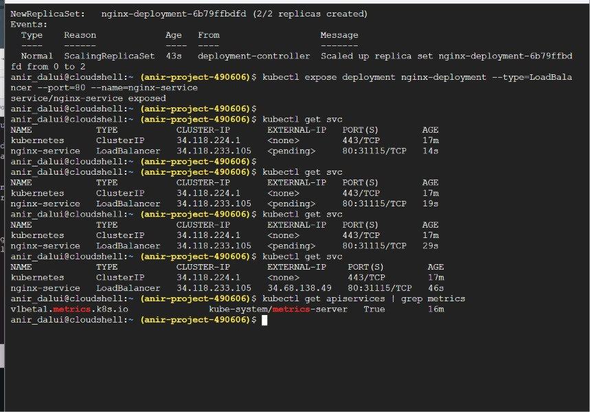

---

## ⚡ HPA Autoscaling

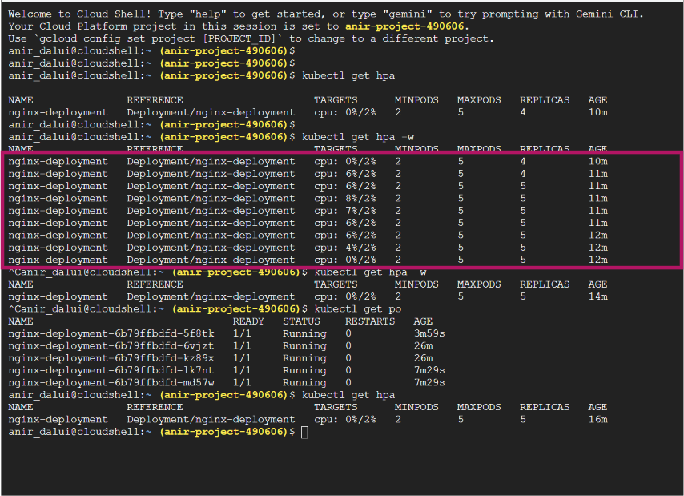

---

## 📈 Metrics Server

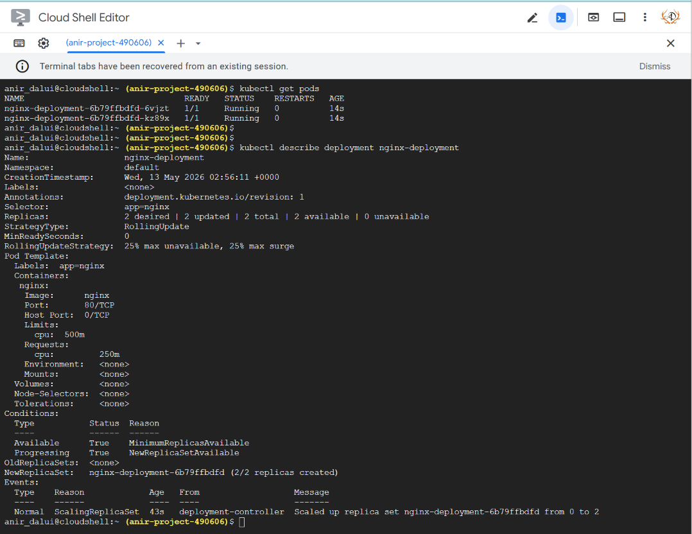

---

## 🔥 Load Testing

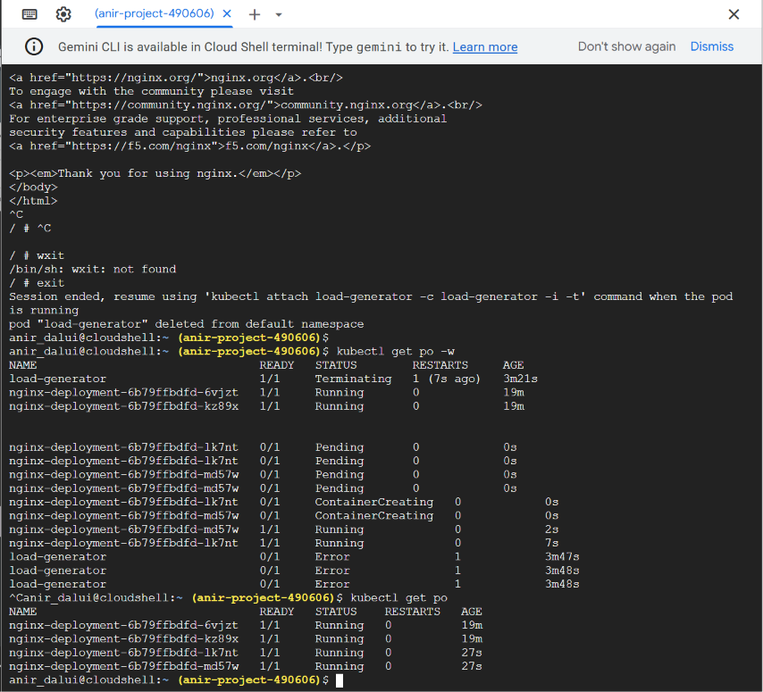

---

## 📊 Prometheus Pods

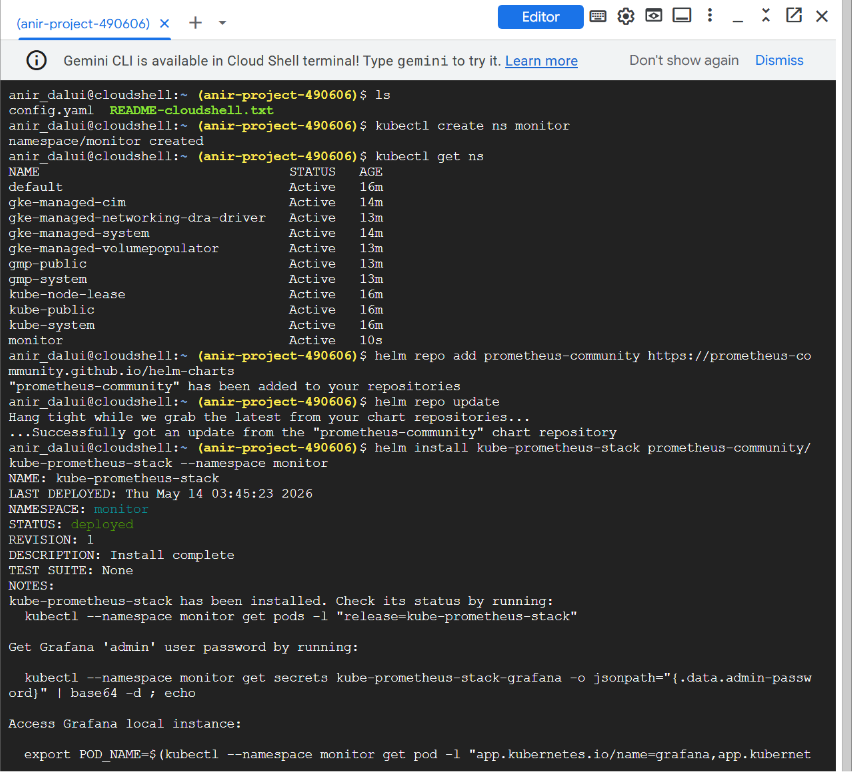

---

## 🌐 Monitoring Services

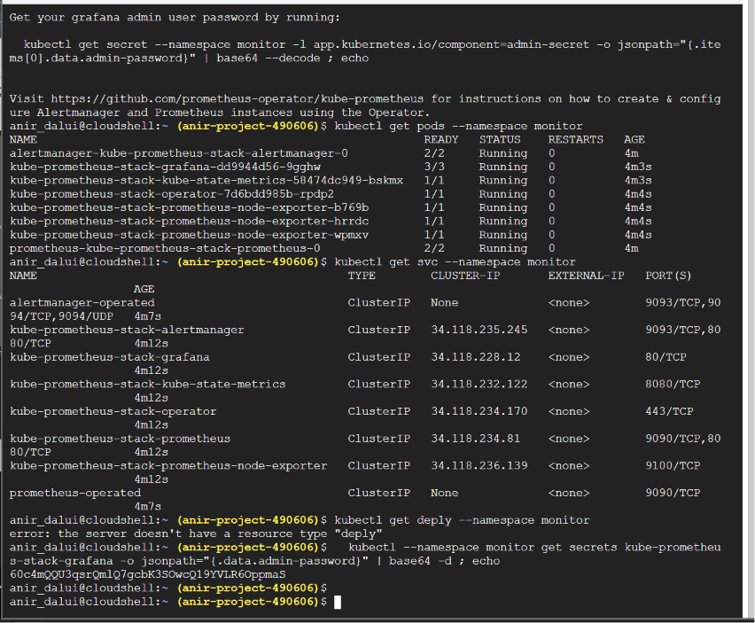

---

## 🔐 Grafana Login

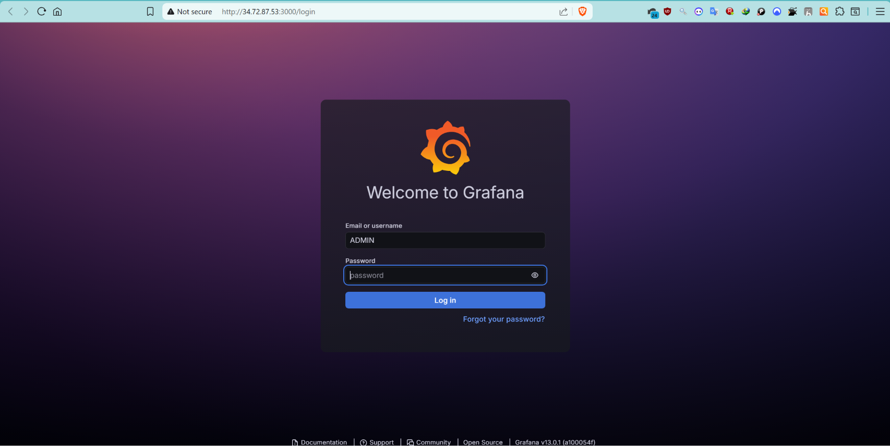

---

## 📊 Grafana Dashboard

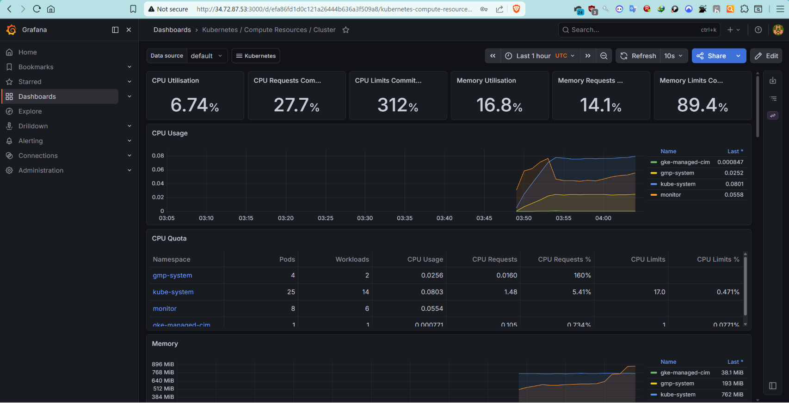

---

## 📈 Cluster Monitoring

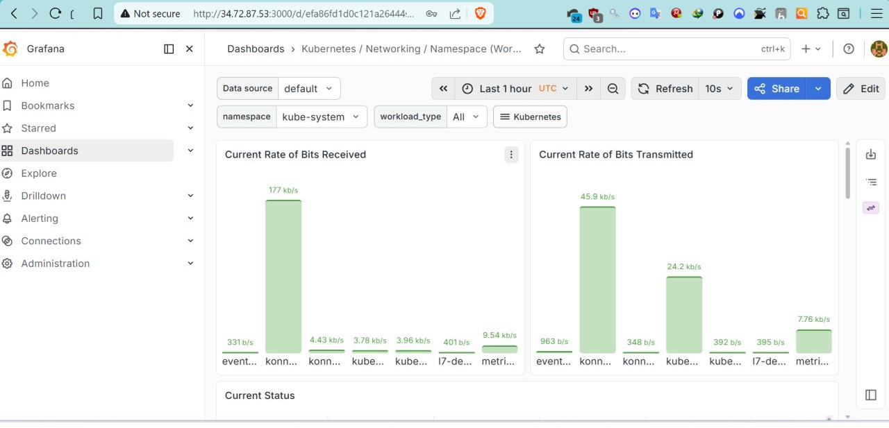

---

## 📉 Kubernetes Monitoring Dashboard

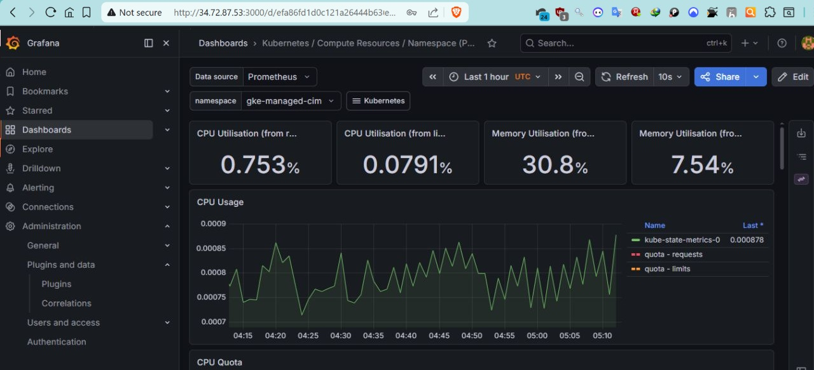

---

# 🔄 Jenkins CI/CD Integration

This platform is designed for CI/CD integration using Jenkins pipelines.

## CI/CD Workflow

```text
GitHub Push
    ↓
Jenkins Pipeline Trigger
    ↓
Docker Image Build
    ↓
Container Registry Push
    ↓
Deploy to GKE
    ↓
HPA Autoscaling
    ↓
Prometheus Monitoring
    ↓
Grafana Visualization
```

---

# 🎯 Key Features

✅ Kubernetes Horizontal Pod Autoscaling  
✅ Google Kubernetes Engine Deployment  
✅ Prometheus Monitoring Stack  
✅ Grafana Visualization Dashboards  
✅ Helm-based Deployment Automation  
✅ Real-time CPU & Memory Monitoring  
✅ Namespace & Pod-level Observability  
✅ Production-style Monitoring Architecture  
✅ Enterprise-grade DevOps Workflow  
✅ CI/CD Integration Ready  

---

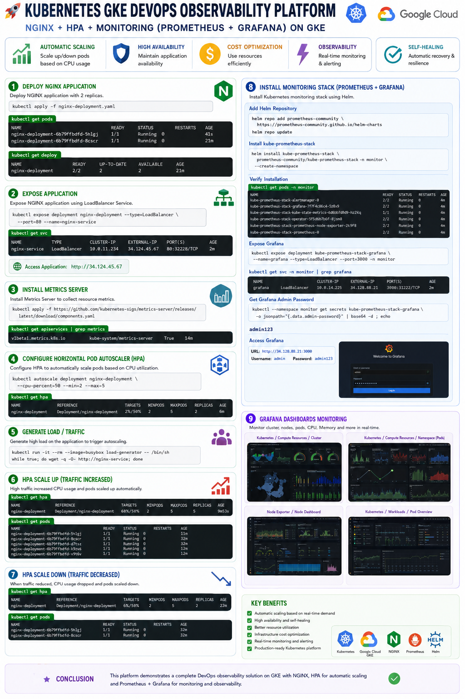

---

# 🚀 Key Benefits

| Feature | Benefit |
|---|---|
| HPA Autoscaling | Dynamic scaling during traffic spikes |
| Metrics Server | Real-time Kubernetes metrics |
| Prometheus | Centralized metrics collection |
| Grafana | Visualization & dashboarding |
| GKE | Managed Kubernetes platform |
| Helm | Simplified deployment management |
| Jenkins | CI/CD integration workflow |

---

# 🧹 Cleanup Commands

```bash
helm uninstall kube-prometheus-stack -n monitor

kubectl delete hpa nginx-deployment

kubectl delete deployment nginx-deployment

kubectl delete svc nginx-service
```

---

# 📚 Official References

## Metrics Server

https://github.com/kubernetes-sigs/metrics-server/releases/latest/download/components.yaml

---

## Prometheus Community Helm Charts

https://github.com/prometheus-community/helm-charts/tree/main/charts/kube-prometheus-stack

---

## Prometheus Community Helm Repository

https://prometheus-community.github.io/helm-charts

---

## Prometheus Operator

https://github.com/prometheus-operator/kube-prometheus

---

# ⭐ Final Outcome

This project demonstrates a complete Kubernetes DevOps Observability Platform on GKE with:

✅ Autoscaling  
✅ Monitoring  
✅ Visualization  
✅ Observability  
✅ CI/CD Workflow Architecture  
✅ Production-style Infrastructure  


---

# 🏷️ Tags

`Kubernetes` `GKE` `DevOps` `Cloud` `Prometheus` `Grafana` `Helm`
`HPA` `Autoscaling` `Monitoring` `Observability`
`Jenkins` `CI/CD` `NGINX`
`Google Cloud` `Containerization`
`Infrastructure Automation`
`Site Reliability Engineering`
`Cloud Native`


---


# 👨‍💻 Author

## Anirban Dalui

Cloud & DevOps Engineer 🚀


---

# ❤️ Thanks for Visiting
If this project helped you learn Kubernetes, Monitoring, Autoscaling, or Observability, consider giving it a ⭐ on GitHub 🚀
